# Krusty Krab – Restaurant Management System

A full-stack restaurant web application built using **PHP**, **MongoDB**, and **JavaScript**.

This system provides complete functionality for customer ordering, reservations, reviews, and an administrative dashboard for managing menu items and reservations.

---

## Features

### Client Side

- Guest landing page with animated slideshow
- Secure login and signup system
- Password hashing (SHA-256)
- Session management & regeneration
- Login attempt throttling
- Menu browsing with category structure
- Breakfast / Lunch time-based ordering restrictions
- Order bill calculation system
- Reservation system with time-slot conflict detection
- Customer review submission
- Integrated NLP-based chatbot (Flask + TF-IDF)

### Admin Panel

- Admin authentication
- Category management (Add / Update / Delete)
- Dish management (Add / Update / Delete)
- Reservation management (AJAX inline editing)
- Review moderation & deletion

---

## Tech Stack

- PHP
- MongoDB
- Composer (mongodb/mongodb)
- JavaScript / jQuery
- HTML / CSS
- Python (Flask, NLTK, Scikit-learn)

---

## Local Setup (Mac)

### Requirements

- PHP 8+
- MongoDB Community Edition
- Composer
- MongoDB PHP extension

### Start MongoDB

\`\`\`
brew services start mongodb-community
\`\`\`

### Install dependencies

\`\`\`
composer install
\`\`\`

### Run PHP server

\`\`\`
php -S localhost:8000
\`\`\`

Then open in your browser:

\`\`\`
http://localhost:8000/homepage.html
\`\`\`

---

## Notes

- Database name: restaurantdb
- MongoDB default connection: mongodb://localhost:27017
- Chatbot runs separately using Python (chatbot4.py)

---

## Future Improvements

If rebuilt today, improvements would include:

- Environment variable configuration (.env)
- MVC structure
- Docker containerization
- Bcrypt/Argon2 password hashing
- Automated tests
- CI/CD pipeline

---

## Screenshots

### 1. Guest Landing Page

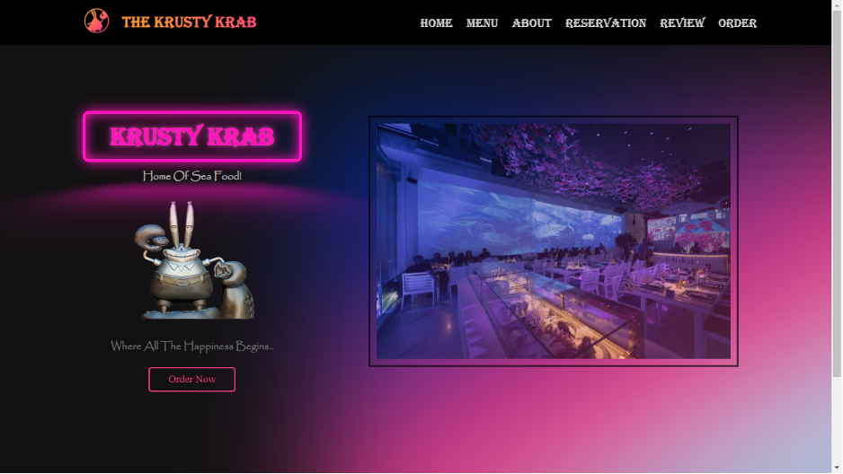

---

### 2. Authentication

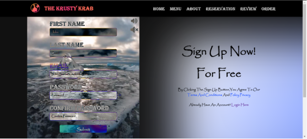

---

### 3. Client Dashboard

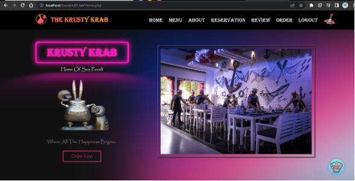

---

### 4. AI Chatbot Integration

---

### 5. Menu & Dishes

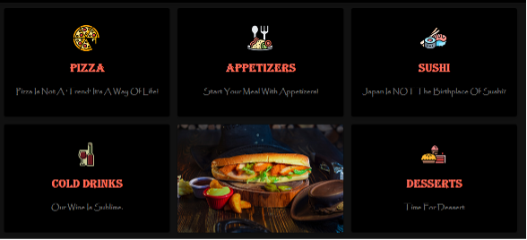
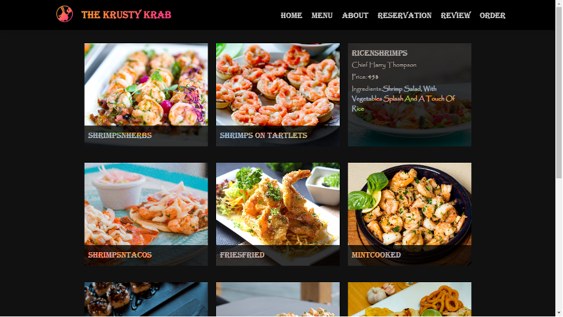
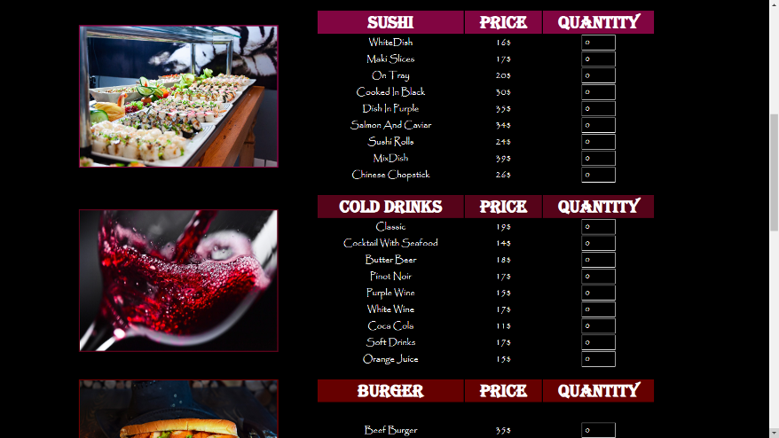

---

### 6. Reservation System

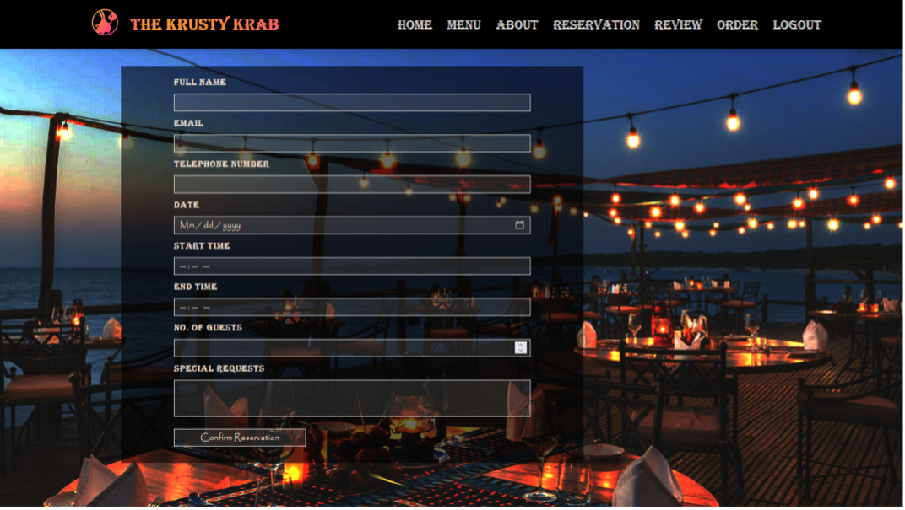

---

### 7. Ordering Flow

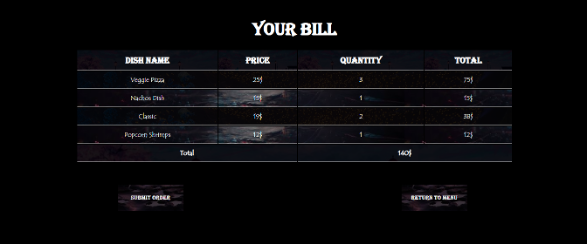

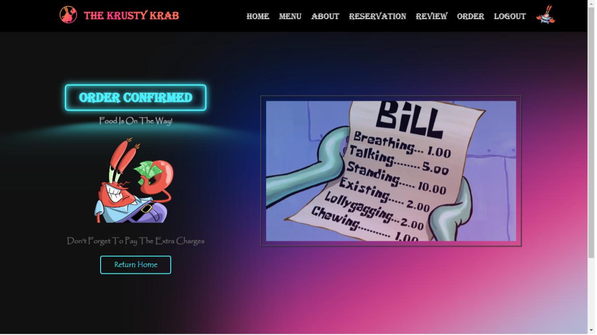

---

### 8. Admin Panel

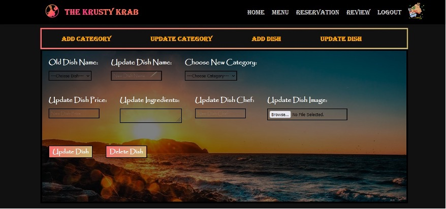
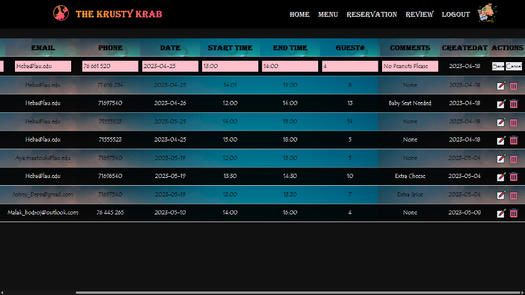
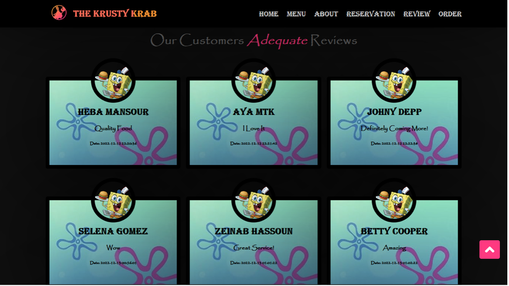
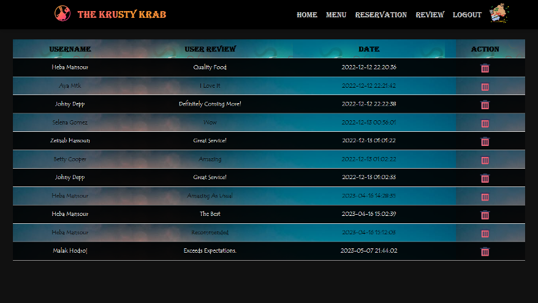

---

## Authors

Aya Maatouk  
Heba Mansour
